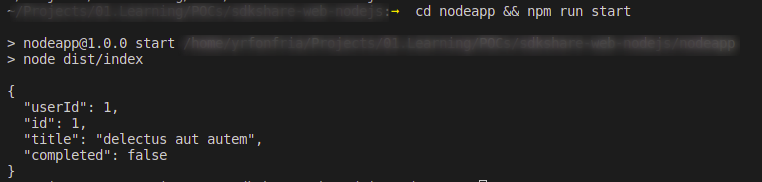
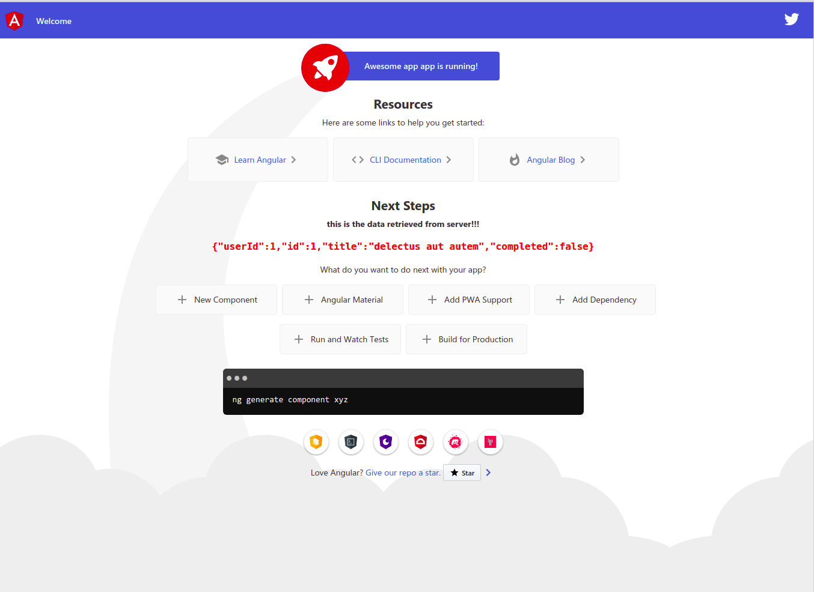

# Example of transport delegation.

The purpose of this POC is demostrate how can we use a SDK that fetch data from external server in both node/angular apps.

What is in the sources:

- nodeapp: node application using the sdk
- webapp: web application using the sdk
- sdk: sdk source


## How to run these examples

### Node App

```
cd nodeapp && npm i && npm run build && npm run start
```

Expected output is like this one:



### Web app

```
cd webapp && npm run start
```

When finished browse http://localhost:4200 you will see an angular application like this. 



Data is retrieved from [this place](https://jsonplaceholder.typicode.com/todos/1)
